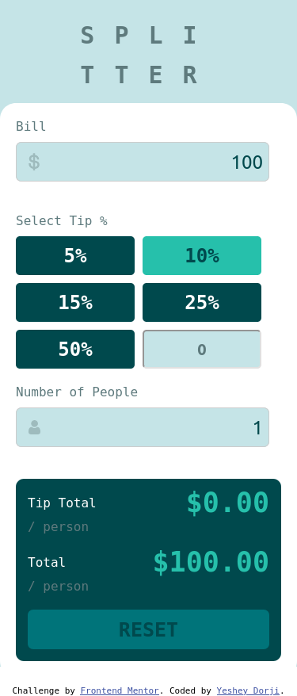

# Frontend Mentor - Tip calculator app solution

This is a solution to the [Tip calculator app challenge on Frontend Mentor](https://www.frontendmentor.io/challenges/tip-calculator-app-ugJNGbJUX). Frontend Mentor challenges help you improve your coding skills by building realistic projects.

## Table of contents

- [Overview](#overview)
  - [The challenge](#the-challenge)
  - [Screenshot](#screenshot)
  - [Links](#links)
- [My process](#my-process)
  - [Built with](#built-with)
  - [What I learned](#what-i-learned)
  - [Continued development](#continued-development)
  - [Useful resources](#useful-resources)
- [Author](#author)

**Note: Delete this note and update the table of contents based on what sections you keep.**

## Overview

### The challenge

Users should be able to:

- View the optimal layout for the app depending on their device's screen size
- See hover states for all interactive elements on the page
- Calculate the correct tip and total cost of the bill per person

### Screenshot

### Links

- Live Site URL: [Add live site URL here](https://your-live-site-url.com)

## My process

### Built with

- Semantic HTML5 markup
- CSS custom properties
- Flexbox
- CSS Grid
- Not Mobile-first workflow 
- Vanilla JS

### What I learned

This was my first FrontendMentor challenge that I did. It was also a project that I took on my own after "learning" from tutorials. I was able to revise a lot of concepts that I learnt in the tutorial. You will only truly learn anything once you take a project on your own. 

I was able to get a full grasp of CSS Grid and Flexbox. 
I guess the code might have gotten clunky, I will revisit it once I am better and make it cleaner.

To see how you can add code snippets, see below:

### Continued development

I should try on more of the challenges so that I have a firm understanding of the basic HTML, CSS and JS before I start learning a framework. I felt weak when I was trying to put the logic of the app together. That made me realize I should do more of the Data Structures and Algorithm exercises to build up my problem solving capability.

### Useful resources

- Mostly I went to MDN resources to get what I wanted. These guide helped me revise the concepts of layout designing.
- [CSS Tricks Grid Guide](https://css-tricks.com/snippets/css/complete-guide-grid/)
- [CSS Tricks Flexbox Guide](https://css-tricks.com/snippets/css/a-guide-to-flexbox/)

## Author

- Frontend Mentor - [@kayd-kun](https://www.frontendmentor.io/profile/kayd-kun)
